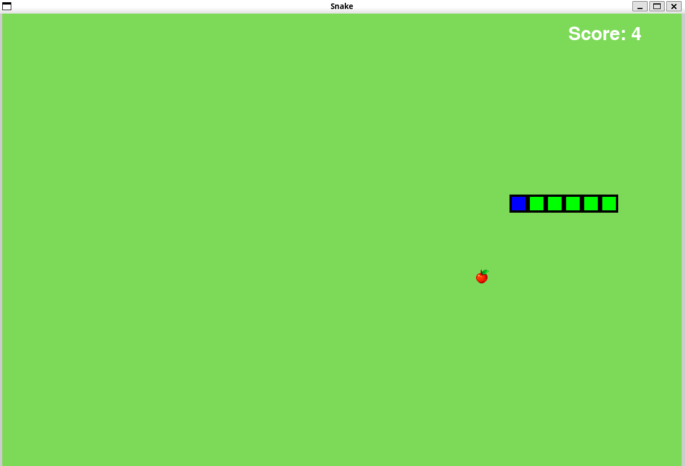
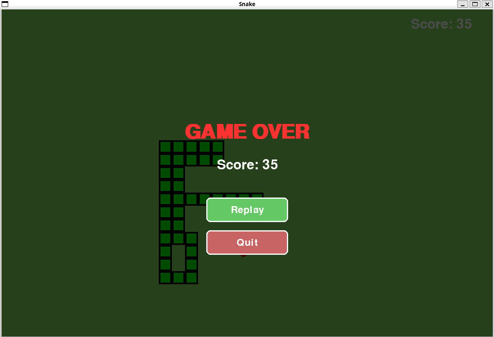

# Snake Game 🐍

A simple and fun Snake game built with Python and Pygame.

## Features

- Keyboard-controlled snake movement
- Eat apples to grow and increase your score
- Game Over screen when the snake collides with itself or the wall
- Score display
- Clean, modular, and object-oriented code structure

## Screenshots

| Gameplay | Game Over |
|----------|-----------|
|  |  |

## Getting Started

1. **Install dependencies:**
   ```bash
   pip install pygame
   ```
2. **Run:**
   ```bash
   python main.py
   ```

